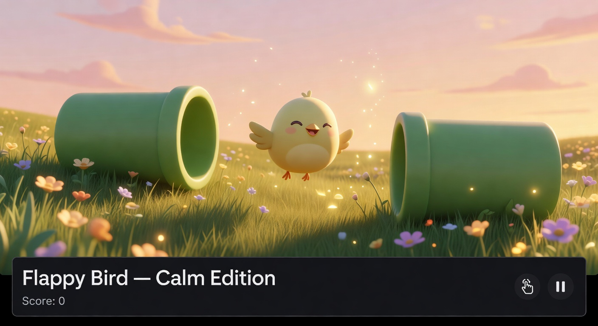

# GlidieBirdie

[](https://github.com/0thernes/glidiebirdie/actions/workflows/ci.yml)
[](LICENSE.txt)
[](game.js)
[](package.json)
[](README.md#accessibility)

A browser-first, one-tap arcade flyer tuned for comfort instead of punishment.

GlidieBirdie keeps the fast arcade loop, then softens the failure edges: slower pacing, gentler
physics, readable visuals, full mobile controls, procedural audio with reverb, a forgiving Feather
Shield, daily seeded runs, five living themes, 12 achievements, a Serene Postcard capture mode, and a
small offline-ready PWA shell. No build step, no runtime dependency, no remote asset requirement.
Just open the file and glide.

[](https://0thernes.github.io/glidiebirdie/)

[Play the live demo](https://0thernes.github.io/glidiebirdie/) ·
[Architecture guide](docs/architecture_master_blueprint.md) ·
[Contributing](CONTRIBUTING.md) ·
[Support](SUPPORT.md)

## Why It Feels Better

| Design goal | What Calm Edition does |
| --- | --- |
| Softer difficulty | Larger pipe gaps, slower travel, gentler gravity, slower terminal fall, circle hitbox. |
| Full mobile depth | On-screen Brake / Flap / Dive buttons on phones — full keyboard depth, no controls hidden. |
| More player expression | Hold Brake (or `Shift`), hold Dive (or `↓`), and tune physics in the Zen Customizer. |
| More delight | Meadow golden godrays + drifting pollen, five themes, reverb, ambient music, particle bursts, expressive bird emotions, cozy achievements, and Serene Postcard mode for shareable moments. |
| Less punishment | Feather Shield absorbs one collision and gives the bird a graceful recovery moment. |
| Better reliability | Delta-time physics + DPR-sharp canvas across 60Hz, 144Hz, 240Hz displays and Retina/4K phones. |
| Better inclusion | Keyboard + skip-link, ARIA live updates, reduced-motion, reduced-transparency, forced-colors. |
| PWA-ready | Installable via Add-to-Home-Screen on iOS and Android. Offline app shell after first visit. |

## The Calm Philosophy

We kept the addictive loop everyone loves and removed everything that hurts. Larger gaps. Gentler
gravity. A shield that forgives. Five living themes you can feel in your chest. Procedural sound that
breathes with the world. A bird with real emotions and eyes that look for safety. No accounts. No ads.
No build step.

This is what happens when you treat "calm" as a design material, not a marketing word. It is a small,
solo, vibe-coded act of care: one HTML file, one CSS file, one engine in `game.js`, zero runtime
dependencies, and a deep commitment to accessibility and reduced-motion respect.

## Features

- **Mobile control bar** — On-screen Brake / Flap / Dive on coarse-pointer devices.
- **PWA install + offline shell** — Add to Home Screen on iOS and Android via a real manifest and service worker.
- **DPR-sharp canvas** — Crisp on Retina, 2× / 3× phones, and 4K monitors.
- **Calm physics presets** — Tune gravity and speed from gentle to lively.
- **Daily Seed mode** — Deterministic pipe pattern by UTC date for friendly comparison.
- **Zen Customizer** — Physics sliders, audio volumes, theme picker, daily-seed toggle, FPS toggle, audio test, reset stats.
- **Five themes** — Sunset, Midnight, Cozy Rain, Aurora, and Meadow (golden-hour greens & warm sunlight), each changing colors, weather, and music.
- **Feather Shield** — A collectible bubble that absorbs one crash and grants brief invincibility.
- **Serene Postcard mode** — Pause into a calm frame and save a shareable PNG (`P` to enter, `C` to capture).
- **Expressive bird** — Calm, happy, scared, determined, and dizzy states with blush, smile, crest, and dizzy swirls.
- **Eye tracking** — Pupils track the nearest safe gap for a lively, readable character.
- **Procedural audio with reverb** — Web Audio creates every tone; convolution reverb gives real ambient space.
- **12 achievements** — From First Flight to Long Haul, each with live progress display.
- **Persistent stats** — Zen minutes, shields saved, runs, near misses, longest survival, current streak.
- **Tutorial overlay** — Shown once on first run; the dismiss button starts the first glide.
- **Fullscreen toggle** — `F` key or button.
- **Zero dependencies** — Pure HTML, CSS, and JavaScript. No bundler, package install, CDN, or assets.

## Quick Start

### Open the game

Open `index.html` directly, or run a tiny local server:

```bash
python -m http.server 8000
```

Then visit `http://localhost:8000`.

### Run the checks

```bash
npm run check
```

That command runs five steps, with no dependencies to install:

- JavaScript syntax check for `game.js`
- JavaScript syntax check for `service-worker.js`
- Static checks (`tests/static-checks.mjs`) — duplicate object keys, duplicate achievement ids, self-comparisons
- Engine behavioral tests (`tests/engine-test.mjs`) — physics, collision, emotion, RNG, and storage invariants
- Repo smoke test (`tests/smoke-test.mjs`) — public surface and repo promises

A separate `npm run typecheck` runs ephemeral TypeScript over the `checkJs`-clean engine.

## Controls

| Input | Action |
| --- | --- |
| `Space` / `Arrow Up` / click / tap | Flap |
| hold `Shift` / on-screen Brake | Slow descent |
| hold `Arrow Down` / on-screen Dive | Controlled dive |
| `Escape` | Pause or resume |
| `M` | Mute or unmute |
| `R` | Restart run |
| `F` | Toggle fullscreen |
| `P` | Serene Postcard mode (calm capture) |
| `C` | Save the current frame as a PNG |

On phones and tablets, the mobile control bar stays visible near the bottom of the screen so the core
actions never depend on hidden gestures.

## Accessibility

Accessibility is part of the product, not cleanup work after the fact.

- Fully keyboard-playable core loop.
- ARIA live region for score and status updates.
- Focus-managed customizer drawer with inert background handling.
- Reduced-motion support for effects, weather, particles, and shake.
- Stronger borders under `prefers-contrast: more` and `forced-colors`.
- Skip link and semantic landmarks for faster navigation.

## Architecture At A Glance

The project is intentionally small and flat:

- `index.html` is the semantic shell, UI layout, mobile controls, drawer, and PWA metadata.
- `style.css` owns layout, theme tokens, accessibility media queries, and component styling.
- `game.js` contains the full runtime engine: physics, rendering, audio, input, persistence, and UI state.
- `manifest.webmanifest` and `service-worker.js` provide installation and offline shell behavior.
- `tests/` holds three dependency-free Node checks wired into `npm run check`.

For the deeper runtime walkthrough, read [docs/architecture_master_blueprint.md](docs/architecture_master_blueprint.md).

## Repository Map

| Path | Purpose |
| --- | --- |
| `index.html` | Semantic shell, canvas, mobile controls, drawer, tutorial, and PWA metadata |
| `style.css` | Layout, theme system, responsive rules, and accessibility styling |
| `game.js` | Main engine file with all runtime logic |
| `manifest.webmanifest` | Install metadata for PWA flows |
| `service-worker.js` | Minimal offline app-shell cache |
| `tests/static-checks.mjs` | Static guards: duplicate keys/ids, self-comparisons |
| `tests/engine-test.mjs` | Headless engine behavioral tests |
| `tests/smoke-test.mjs` | Syntax and surface-area smoke checks |
| `docs/architecture_master_blueprint.md` | Calm, humble philosophy & technical architecture reference |
| `docs/assets/` | Cinematic hero + social preview images |
| `AUDIT-250.md` | Canonical 250-point quality audit ledger |
| `CHANGELOG.md` | Version history |
| `AGENTS.md` | Cross-tool AI assistant guidance + the protected merge flow |
| `CLAUDE.md` | Claude-specific project context |
| `CODE_OF_CONDUCT.md` | Calm, welcoming community guidelines tuned to this project's spirit |
| `CONTRIBUTING.md` | Contributor workflow and change boundaries |
| `SUPPORT.md` | Troubleshooting and where to get help |
| `.github/` | CI workflow, Dependabot, `SECURITY.md`, issue templates, and Copilot guidance |
| `.memory/` | Project notes for future maintainers and assistant sessions |
| `LICENSE.txt` | MIT license text |

## New Here? Read In This Order

1. `README.md` — the product and workflow overview.
2. `docs/architecture_master_blueprint.md` — the runtime layout.
3. `CONTRIBUTING.md` — change boundaries and review expectations.
4. `AGENTS.md` / `CLAUDE.md` — AI-assistant guardrails and the protected merge flow.

## Browser Support

- Chrome and Edge 105+
- Firefox 128+
- Safari 16.4+
- Samsung Internet 21+
- Current iOS Safari and Android Chrome

## Contributing

Contributions are welcome when they keep the game calm, accessible, dependency-free, and easy to run.
Start with [CONTRIBUTING.md](CONTRIBUTING.md) and our [Code of Conduct](CODE_OF_CONDUCT.md), then use the
issue templates for bugs, feature ideas, or accessibility feedback.

Small, focused changes are preferred. Keep the project dependency-free, browser-first, and calm by default.

## Support

If the game does not run as expected, start with [SUPPORT.md](SUPPORT.md).

## License

MIT. See [LICENSE.txt](LICENSE.txt).

Use it, fork it, remix it, ship it — a short attribution notice is all that's asked.
