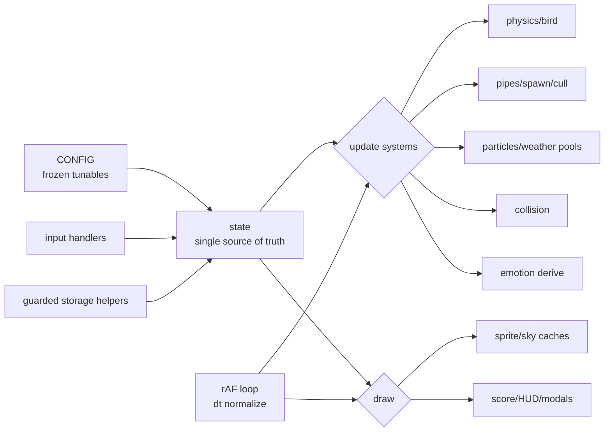
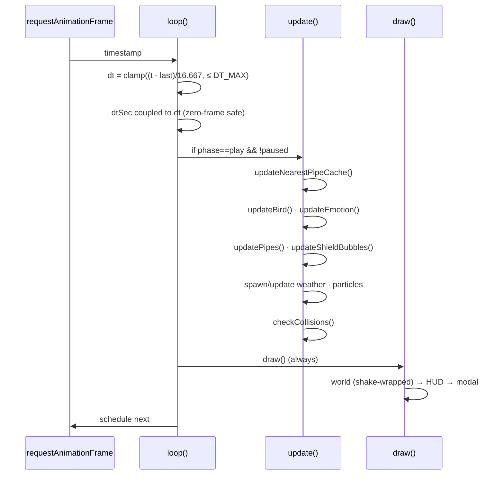
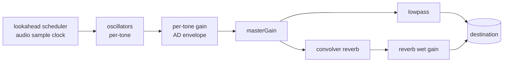

<!-- markdownlint-disable MD013 -->

# GlidieBirdie — Architecture

A precise, diagram-backed walkthrough of how the game is built. Companion to
[`architecture_master_blueprint.md`](architecture_master_blueprint.md) (narrative) and
[`DATA-MODEL.md`](DATA-MODEL.md) (persistence ERD).

## 1. One-paragraph summary

GlidieBirdie is a **single-file, zero-dependency, canvas-rendered browser game** plus a tiny PWA
shell. There is no build step, no framework, and no backend. `index.html` is the semantic shell,
`style.css` is all presentation, and `game.js` is the entire runtime engine — a `requestAnimationFrame`
loop driving a fixed-timestep-normalized simulation over a single mutable `state` object, rendered to
one DPR-scaled `<canvas>`. A `service-worker.js` adds offline/install behavior. Everything is delivered
as static files on GitHub Pages.

## 2. Component map

```mermaid
graph TD
  subgraph Static Delivery (GitHub Pages)
    HTML[index.html<br/>semantic shell + DOM contract]
    CSS[style.css<br/>layout · themes · a11y]
    JS[game.js<br/>engine ~3.4k LOC]
    SW[service-worker.js<br/>offline shell]
    MAN[manifest.webmanifest<br/>install metadata]
  end
  HTML -->|defer| JS
  HTML -->|link| CSS
  HTML -->|link| MAN
  JS -->|register| SW
  JS -->|render| CANVAS[(canvas#game)]
  JS -->|persist| LS[(localStorage gb:*)]
  JS -->|synthesize| WA[(Web Audio graph)]
```

## 3. Engine internal structure (`game.js`)

The engine is organized into numbered, single-responsibility sections:



**Section order:** CONFIG → DOM cache → RNG → STORAGE → AUDIO → STATE → THEME TABLES → SPRITE CACHE →
WORLD (bird/ground/pipes/pools) → PHYSICS → RENDER → UI (drawer/mobile/focus-trap/fullscreen/haptics) →
STATS → ACHIEVEMENTS → LIFECYCLE → INPUT → LIFECYCLE EVENTS → OFFLINE SHELL → CUSTOMIZER → LOOP → BOOT.

## 4. The frame loop (data flow per frame)



**Invariant:** `update()` only runs in active play; `draw()` always runs so menus/pause/gameover render.
The `dt` clamp is **load-bearing** — it makes collision tunneling impossible at any frame rate or preset.

## 5. Rendering model

- One global transform matrix; `ctx.save()/restore()` strictly balanced.
- **Painter's algorithm:** background → pipes → shield bubbles → ground → bird trail → bird → bird shield → weather → particles → score → meters → flashes → vignette → FPS, then (outside the shake transform) the modal panel.
- **Screen shake** translates the whole world render but is applied *before* the modal, so game-over text never shakes.
- **Sprite caching:** the bird is pre-rendered to an offscreen canvas per `(theme, emotion)` — 25 small canvases — so the per-frame cost is one `drawImage` plus the dynamic wing/eyes overlay.
- **DPR awareness:** the canvas backing store is `420×640 × devicePixelRatio`; all drawing is in logical units via `setTransform(dpr,…)`.

## 6. Audio architecture



Procedural only (no audio files). Music is scheduled on the **audio clock** (drift-free), SFX and music
have **independent volume channels**, and the whole graph is lazily built on the first user gesture.

## 7. Persistence

All state persists to `localStorage` under a `gb:` namespace via a single `SK` key map, behind guarded
read/write helpers (clamp + NaN fallback + try/catch). A one-time `migrateLegacyStorage()` carries
pre-rebrand keys forward. The service-worker cache name is tied to `package.json` version. See
[`DATA-MODEL.md`](DATA-MODEL.md) for the full entity diagram.

## 8. Boot sequence

```
configureCanvasForDPR()  → updateDerivedPhysics() → resetGame()
→ bindDrawerControls() → bindMobileControls() → bindTutorial()
→ registerServiceWorker() → syncUiState() → attach lifecycle listeners
→ requestAnimationFrame(loop)
```

Linear, idempotent, and defensive (every DOM ref is optional-chained, so a missing element no-ops).

## 9. Key invariants (do not break)

| Invariant | Why it matters |
|---|---|
| `dt` clamped to `DT_MAX` | Collision tunneling-proof at any frame rate/preset |
| `dtSec` coupled to `dt` on zero-elapsed frames | Prevents `time` vs `elapsedSec` drift / cooldown stalls |
| Squash/stretch is visual-only | Hitbox stays predictable |
| Exponential decay uses `Math.pow(base, dt)` | Frame-rate-independent drag/shake |
| All storage via guarded helpers + `SK` map | Corruption-safe, namespaced, migratable |
| `globalAlpha` reset after each alpha pass | No accidental global translucency |
| Audio/storage wrapped in try/catch | Non-essential systems never crash a frame |

## 10. Extension points (how to add things safely)

- **New theme:** add a `THEME_TABLE` entry + a `body.theme-*` block in CSS + a music entry. Table-driven, no branching.
- **New tunable:** add to frozen `CONFIG`; never inline a magic number.
- **New persisted value:** add a key to `SK`, read via a guarded helper, document it in `DATA-MODEL.md`.
- **New effect:** spawn through the existing pools; never allocate in the hot loop.
- **New gate:** add a check to `npm run check`; if it touches `.github/`/`tests/`, expect the Guardrail check.

## 11. Constraints (architectural guardrails)

- No build step, no runtime dependencies, no backend, no remote assets/fonts/CDN.
- Do not split `game.js` or `style.css`.
- Keep the service worker tiny and app-shell-focused.
- `main` is PR-gated; every change flows branch → PR → CI → auto-merge.
