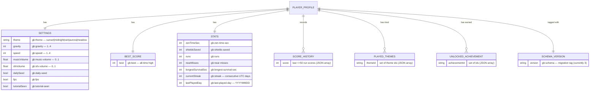
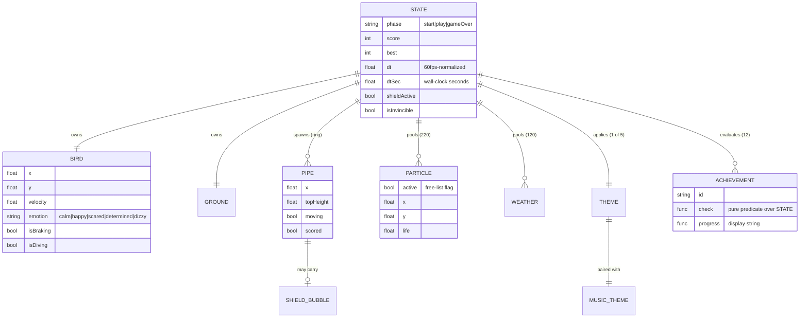

<!-- markdownlint-disable MD013 -->

# GlidieBirdie — Data Model (ERM / ERD)

GlidieBirdie has **no backend, no accounts, and no relational database** — by
design (see [Design Boundaries](architecture_master_blueprint.md#design-boundaries)).
So this document models the two data domains that *do* exist:

1. **Persisted domain** — what lives in `localStorage` under the `gb:` namespace
   (the closest thing to a "schema" the game has).
2. **Runtime domain** — the in-memory entities the engine simulates each frame.

> **On ERP:** Enterprise Resource Planning has no meaningful surface here — there
> are no resources, inventory, finance, or HR processes to plan. A backend-less
> arcade toy's "ERP" is intentionally empty; the equivalent *operational* model
> is the CI/CD + release pipeline documented in [CI/CD](#cicd-operational-model).

---

## 1. Persisted entity model (localStorage)

Everything is scoped to a single browser origin = one implicit **PlayerProfile**.
There are no foreign keys at the storage layer (localStorage is a flat string
KV store); the diagram shows the *conceptual* relationships the code enforces.
Each entity is one or more `gb:*` keys read/written through the guarded `SK` map.

### Migration contract

`migrateLegacyStorage()` runs **once per device**, before the first read in
`state`. If `gb:schema` is unset it copies each legacy key
(`flappy-best`, `zen-time-sec`, `current-streak`, …) to its `gb:*` equivalent
via `LEGACY_KEY_MAP`, deletes the old key, then stamps `gb:schema = "3"`.
This is what lets existing players keep their saves across the rename. All
reads/writes go through the `SK` constant — never a bare string — which the
brand-guard and code review can verify.

---

## 2. Runtime entity model (in-memory, per frame)

These objects live for the session (or a run) and are never persisted except
where they feed the STATS/SCORE_HISTORY entities above.

---

## 3. Key invariants

- **Single writer per key.** Only the `SK`-routed helpers mutate persisted state.
- **Bounded pools.** `PARTICLE` ≤ 220, `WEATHER` ≤ 120 — fixed-capacity, no
  per-frame allocation (see [`COMPLEXITY.md`](COMPLEXITY.md)).
- **Achievements are pure.** `check()` / `progress()` are read-only functions of
  `STATE`; adding one is an array entry + matching `#ach<Id>` markup.
- **Determinism.** In Daily-Seed mode, `PIPE` geometry is a pure function of
  `dateSeed()` → identical layout for everyone on a given UTC date.

---

## CI/CD operational model

The "operational planning" layer of a backend-less game is its release
pipeline, not an ERP. See [`architecture_master_blueprint.md`](architecture_master_blueprint.md#validation-and-release-flow)
and the workflows in `.github/workflows/` (CI, guardrail guard, Dependabot
auto-merge, post-deploy canary). The release/iteration board lives in
[`ROADMAP.md`](ROADMAP.md).
