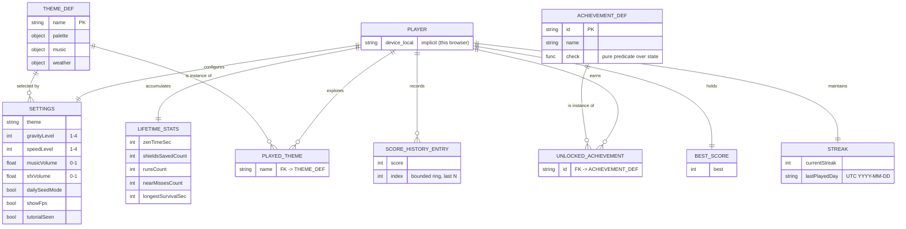
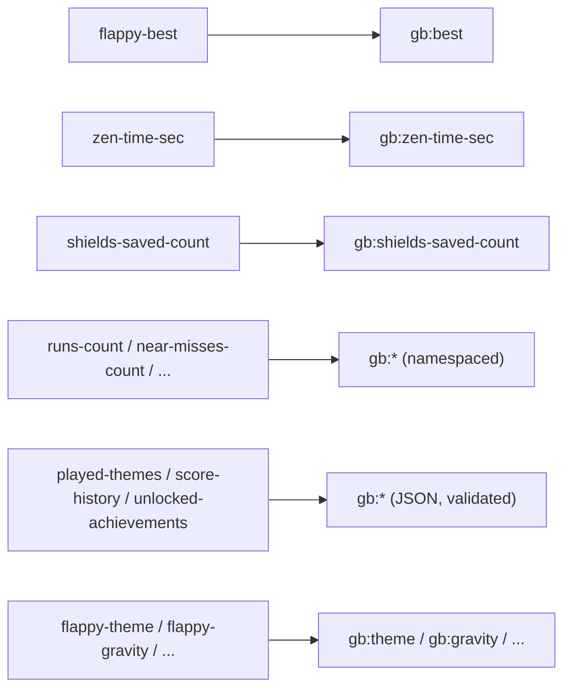
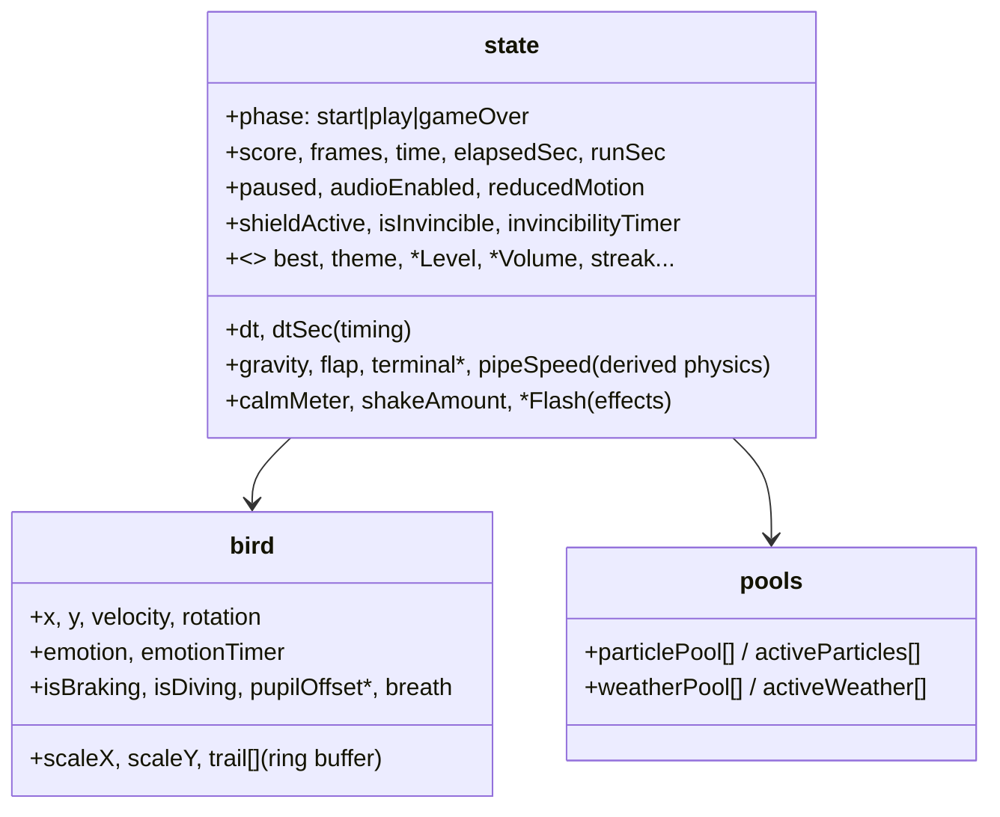

<!-- markdownlint-disable MD013 -->

# GlidieBirdie — Data Model (ERM / ERD)

The game has **no database and no backend**. Its entire persistent "data layer" is the browser's
`localStorage`, accessed through guarded helpers and a single `SK` key map under a `gb:` namespace.
This document is the conceptual data model (entity-relationship view), the physical key schema, and the
legacy → current migration map.

## 1. Conceptual model (ERD)

`ACHIEVEMENT_DEF` and `THEME_DEF` are **code-defined** (in `game.js`), not persisted; only the *instances*
a player has earned/visited are stored. This keeps the persisted footprint tiny and forward-compatible.

## 2. Physical schema (`localStorage`, `gb:` namespace)

All keys are addressed through the `SK` map and guarded helpers (clamp + NaN/JSON fallback + try/catch).

| Key | Type | Domain / constraint | Default |
|---|---|---|---|
| `gb:best` | int | ≥ 0, monotonic | 0 |
| `gb:zen-time-sec` | int | ≥ 0 | 0 |
| `gb:shields-saved-count` | int | ≥ 0 | 0 |
| `gb:runs-count` | int | ≥ 0 | 0 |
| `gb:near-misses-count` | int | ≥ 0 | 0 |
| `gb:longest-survival-sec` | int | ≥ 0 | 0 |
| `gb:current-streak` | int | ≥ 0 | 0 |
| `gb:last-played-day` | string | UTC `YYYY-MM-DD` | "" |
| `gb:played-themes` | JSON string[] | subset of theme names | `["sunset"]` |
| `gb:score-history` | JSON int[] | bounded (last N), each ≥ 0 | `[]` |
| `gb:unlocked-achievements` | JSON string[] | subset of achievement ids | `[]` |
| `gb:theme` | enum | sunset\|midnight\|rain\|aurora\|meadow | sunset |
| `gb:gravity` | int | 1–4 | 2 |
| `gb:speed` | int | 1–4 | 2 |
| `gb:music-volume` | float | 0–1 | 0.6 |
| `gb:sfx-volume` | float | 0–1 | 0.8 |
| `gb:daily-seed` | bool | — | false |
| `gb:fps` | bool | — | false |
| `gb:tutorial-seen` | bool | — | false |

**Integrity rules:** every read clamps to its domain and falls back to the default on `NaN`/parse error;
collections are validated to be arrays of the right primitive; writes never throw (storage-disabled safe).

## 3. Migration (legacy → `gb:`)

`migrateLegacyStorage()` runs once and is idempotent. It carries pre-rebrand keys forward so existing
players keep their saves through the rename and namespacing.

Migration is run-once (a sentinel prevents re-copying), validating-on-read, and non-destructive.

## 4. Runtime state (in-memory, not persisted)

The live game holds a single `state` object plus a `bird` object and pools. This is **derived/ephemeral**
and reset per run; only the entities above survive a reload.

## 5. Why this is the right data model for the project

- **No PII, no backend, no DB** → trivially privacy-compliant and zero-ops.
- **Namespaced + versioned + migrated** → survives renames and schema evolution.
- **Code-defined definitions, persisted instances** → tiny footprint, forward-compatible.
- **Guarded everywhere** → corrupt or disabled storage degrades gracefully (tested).
