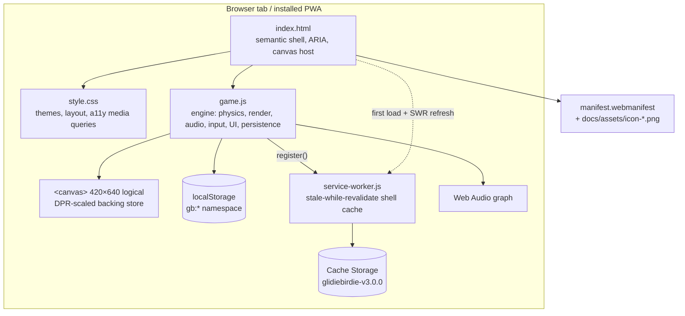
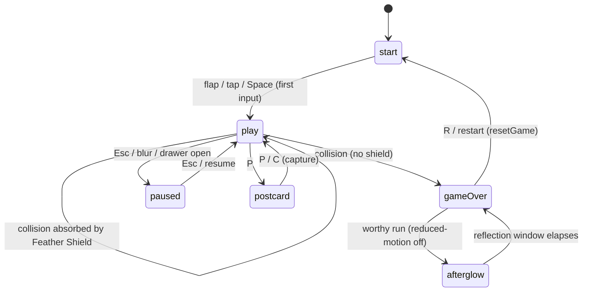
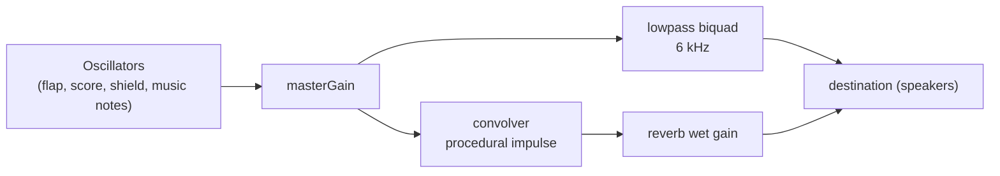
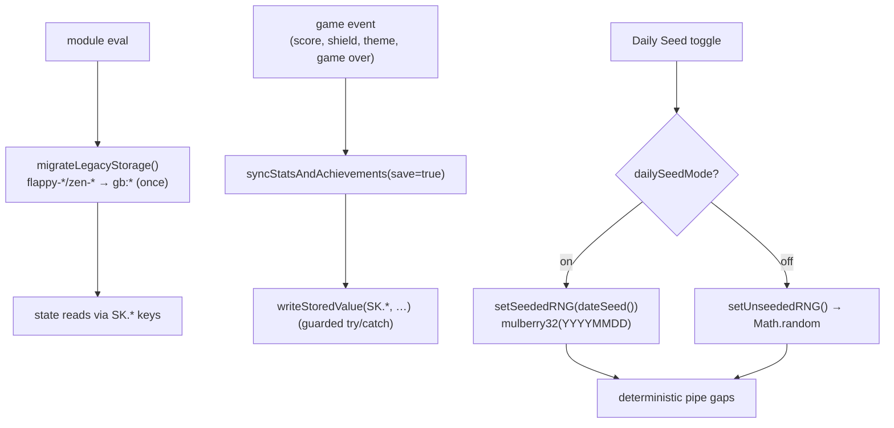

<!-- markdownlint-disable MD013 -->

# GlidieBirdie — System Diagrams

Visual companion to [`architecture_master_blueprint.md`](architecture_master_blueprint.md).
All diagrams are [Mermaid](https://mermaid.js.org/) and render natively on GitHub.

---

## 1. Component / container view

How the static app shell fits together at runtime. There is no backend and no
network data flow for gameplay — every box below ships as a static file.



---

## 2. Game phase state machine

`state.phase` is the single source of truth for lifecycle. `paused`,
`postcardMode`, and the `afterglow*` flags are orthogonal modifiers layered on
top of `play` / `gameOver`.



---

## 3. Frame loop (one `requestAnimationFrame` tick)

The loop is delta-time normalized: every motion term is multiplied by `state.dt`
(1.0 at 60 fps) so behavior is identical at 60/144/240 Hz. `dt` is clamped to
`DT_MAX` (3) so a lag spike can't tunnel the bird through a pipe.

```mermaid
sequenceDiagram
  participant RAF as requestAnimationFrame
  participant Loop as loop(ts)
  participant Upd as update()
  participant Draw as draw()
  RAF->>Loop: timestamp
  Loop->>Loop: dt = min((ts-last)/16.67, 3)
  Loop->>Loop: dtSec, elapsedSec, afterglow timer
  alt frame-error cooldown active
    Loop-->>RAF: schedule next, skip work
  else
    Loop->>Upd: update() (only if phase=play & !paused)
    Upd->>Upd: bird, pipes, shields, particles, weather
    Upd->>Upd: checkCollisions()
    Loop->>Draw: draw() (always — renders start/pause/gameover too)
  end
  Loop->>RAF: requestAnimationFrame(loop)
```

---

## 4. Audio signal graph

Built once on first user gesture (`ensureAudio`). SFX are scheduled on the
`AudioContext` sample clock (drift-free), never `setTimeout`.



---

## 5. Persistence & daily-seed data flow



See [`DATA-MODEL.md`](DATA-MODEL.md) for the entity model behind `gb:*`.
