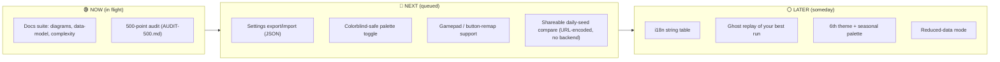

<!-- markdownlint-disable MD013 -->

# GlidieBirdie — Roadmap & Kanban

A lightweight, honest board for a solo project. Columns follow the Now / Next /
Later convention; **Done** captures shipped work and **Icebox** records ideas
deliberately *rejected* (with the reason), which is as important as the backlog.

> This board is the project's "operational planning" layer — see the note in
> [`DATA-MODEL.md`](DATA-MODEL.md#on-erp). For automated tracking you can mirror
> these into GitHub Projects; the source of truth is this file + `CHANGELOG.md`.

---

## Board

---

## 🟢 Now

| Item | Acceptance |
| --- | --- |
| Documentation suite | Diagrams, data model/ERD, complexity, roadmap committed and linked from README |
| 500-point inspection | `AUDIT-500.md` with 25 sections × 20 points, grounded in the code |
| DSA pass | Hot-path memoization shipped; complexity documented |

## 🔵 Next

| Item | Why | Constraint to honor |
| --- | --- | --- |
| Settings export/import | Lets players move saves between devices without a backend | JSON blob via download/upload; no network |
| Colorblind palette toggle | Accessibility depth beyond current redundancy cues | Pure CSS variables; respect `forced-colors` |
| Gamepad support | Controller players + accessibility | `Gamepad API`, polled in the existing loop — O(1) |
| Shareable daily-seed compare | The cheap, backend-free "leaderboard" the VC review asked for | Encode score+seed in the share URL; verify client-side only |

## ⚪ Later

| Item | Notes |
| --- | --- |
| i18n string table | Externalize UI strings; keep zero-dependency (plain JSON) |
| Ghost replay | Record input timeline (seeded), replay deterministically |
| Additional themes | Each is one `THEME_TABLE` + `musicThemes` entry (see DATA-MODEL) |
| `prefers-reduced-data` | Drop weather density / skip reverb impulse on metered connections |

## ✅ Done (shipped — see `CHANGELOG.md`)

- **v3.0.0** — Rebrand to GlidieBirdie, AGPL→MIT relicense, 6 Gold-level fixes
  (calendar-day streak, namespaced+migrated storage, SWR cache, tutorial modal
  a11y, death-timer leak fix, PNG install icons + canonical/robots/sitemap).
- **DSA** — O(1) achievement-element cache; O(1) service-worker app-shell Set.
- **Engine** — delta-time physics, DPR canvas, circle hitbox, object pools,
  Web Audio + reverb, 5 themes, 12 achievements, daily seed, Serene Postcard.
- **CI/CD** — `npm run check` (static + brand/link/license guards + 29 engine
  tests + smoke) and `npm run typecheck`; guardrail guard; Dependabot
  auto-merge (majors held); post-deploy canary.

## 🧊 Icebox (considered, rejected — recorded so it isn't re-litigated)

| Idea | Why rejected |
| --- | --- |
| Backend leaderboard / accounts | Violates the no-backend boundary; brings auth, PII, GDPR. Use URL-encoded seed compare instead. |
| Bundler / framework (React, Vite) | Violates no-build / zero-dependency; the single-file engine is intentional. |
| Splitting `game.js` into modules | Hard rule: one engine file. Section dividers provide structure instead. |
| WASM physics | Needs a build toolchain; the JS physics is already O(1)/frame and well under budget. |
| Anti-cheat on scores | Open-source, client-only game — score hacking is explicitly accepted (no stakes). |
