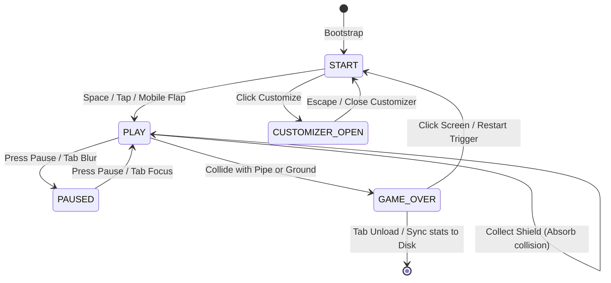

<!-- markdownlint-disable MD009 MD022 MD031 MD032 MD040 MD041 MD058 -->

# 🏆 Universal Master Architecture Blueprint & Staged Engineering Roadmap
## Zero to Hero: FAANG/MANGO-Tier Software Architecture, Design Systems, and DevOps Pipeline
**Target Application class**: Static Client-First Web PWAs, Interactive Real-Time Game Engines, and Scale-Ready Microservices  
**Compliance Standard**: Gold Standard SOP Tier-1 Corporate 25 Tech GAYMAN/MANGO/FAANG  

---

## 🗂️ Table of Contents
1. **The Software Architecture Philosophy: Monoliths vs. Distributed Scaling**
2. **Universal Software Principles: The Zero-Dependency Paradigm**
3. **Responsive Visual & Ergonomic Design Systems**
4. **Real-Time Physics Math & Mathematical Simulation Mechanics**
5. **Zero-GC Allocation & High-Performance Memory Engineering**
6. **Procedural Client-Side Audio Synthesis & Waveform Math**
7. **Data Schema Robustness, Local-First Persistence & Resilient Fallbacks**
8. **Automated Verification, DevOps Continuous Integration & Hardened Hygiene**
9. **Universal 8-Stage Zero-to-Hero Production Engineering Roadmap**
10. **Unified Entity-Relationship Model (ERM) & Active State Transitions**
11. **DevOps Pipeline, Release Orchestration & Continuous Delivery Flows**
12. **Systems Mathematical Derivations & DSP Bilinear Transform Analysis**

---

## 1. The Software Architecture Philosophy: Monoliths vs. Distributed Scaling

Every software engineering project begins with a fundamental architectural choice: **where do we place our complexity boundaries?** High-velocity prototyping (vibe-coding) and solo developer MVPs require a highly tight, self-contained scope to optimize cognitive bandwidth.

```
       Elite Prototyping Domain                      SaaS Scaled Enterprise Domain
   ┌────────────────────────────────┐               ┌────────────────────────────────┐
   │    The Modular Monolith        │               │   Distributed Microservices    │
   │                                │               │                                │
   │  - Zero network serialization  │  Transition   │  - Separate deployment units   │
   │  - Direct in-memory operations │ ────────────> │  - Polyglot runtime tech stack │
   │  - Single context AI alignment │               │  - Infinite horizontal scaling │
   │  - Zero overhead boot cycles   │               │  - Distributed database meshes │
   └────────────────────────────────┘               └────────────────────────────────┘
```

### Monolith vs. Distributed Microservices Comparison
| Metric | AI-Friendly Modular Monolith | Distributed Enterprise Microservices |
| :--- | :--- | :--- |
| **Boot and Hydration Cost** | $<50\text{ms}$. Native browser processing. | $2\text{s} - 15\text{s}$. Container boot, routing tables, hydration graphs. |
| **Network Overhead** | **Zero.** Local-first execution and direct memory access. | **High.** REST/gRPC serialization, JSON parsing, API gateway routing. |
| **Operational Maintenance** | **Minimal.** Single directory structure, simple script deploys. | **Complex.** Kubernetes configurations, Service Meshes, Redis caches. |
| **Context Window Affinity** | **Excellent.** Complete code fits inside a single context window. | **Poor.** Code split across multiple repositories, confusing AI pairing. |

### The "AI-Native Monolith" Architectural Rationale
Splitting code into micro-modules too early introduces unnecessary compilation overhead, complex import graphs, and dependency maintenance cycles. In modern AI-pair programming, **keeping the entire codebase in a single modular file is a high-performance pattern**. 

By grouping physics, drawing, audio, and state loops inside a single scope using strict declarations (`"use strict"` and `@ts-check`), we eliminate namespace collisions, enable the browser to optimize executing branches natively, and allow AI models to hold the **complete system context** at once.

---

## 2. Universal Software Principles: The Zero-Dependency Paradigm

Modern software is often bloated with thousands of transitive npm packages, which introduces security risks, version conflicts, and build-time lags. **Tier-1 Engineering prioritizes vanilla browser capabilities**, maximizing performance and security.

```mermaid
graph TD
    subgraph Heavy Modern Web Stack
        A[App Logic] --> B[Framework React/Vue]
        B --> C[Webpack/Vite Bundler]
        C --> D[transpiler Babel/SWC]
        D --> E[Node Runtime env]
        E --> F[2,000+ npm packages]
    end
    subgraph Zero-Dependency Calm Stack
        G[index.html: Accessibility DOM] --> H(style.css: Cascade themes)
        G --> I(game.js: Native Engine)
        I --> J[2D Canvas API]
        I --> K[Web Audio API]
        I --> L[guarded localStorage]
    end
    style G fill:#0f172a,stroke:#38bdf8,stroke-width:2px;
    style I fill:#0f172a,stroke:#facc15,stroke-width:2px;
    style K fill:#0f172a,stroke:#4ade80,stroke-width:2px;
```



### The Three Pillars of Dependency-Free Engineering
1. **Direct Platform Execution**: Bypass build steps (Vite, Webpack, Babel) by writing clean, modern JavaScript supported natively by active browser engines. This guarantees **zero setup latency**—the application runs instantly from local storage or any basic file server.
2. **Procedural Asset Generation**: Eliminate asset pipelines and network requests for graphics, sound files, or custom typography. By synthesizing audio dynamically via the Web Audio API and rendering vector layouts inside Canvas 2D, the application remains fully secure and loads instantly.
3. **Resilient Local Persistence**: Avoid database maintenance for client preferences. Maintain state directly on the client using browser storage wrapped in safe validation limits. This keeps deployment trivial while remaining fully accessible to power users.

---

## 3. Responsive Visual & Ergonomic Design Systems

An application must scale smoothly and remain highly responsive, regardless of whether it is viewed on a 4K desktop monitor or an iPhone SE.

```
       Desktop Dashboard Layout                 Mobile Portrait Viewport
    ┌──────────────────────────────┐                ┌──────────────┐
    │          Hero Panel          │                │  Canvas area │
    ├──────────────┬───────────────┤                │  (Playfield) │
    │ Toolbar menu │  Canvas area  │                ├──────────────┤
    │              │  (Playfield)  │                │ Mobile Ctrl  │
    └──────────────┴───────────────┘                └──────────────┘
```

### CSS Cascade Layering & Design Tokens
Organizing CSS inside explicit cascade layers (`@layer`) guarantees predictable rule evaluation, fully separating layout concerns:
```css
@layer base, layout, components, utilities;
```
1. **`base`**: Resets browser defaults, establishes system typography, disables double-tap zooms, and sets standard safe-area margins.
2. **`layout`**: Implements global shell structures (flexbox grids) and glassmorphic panels utilizing high-performance backdrop blurs with non-blur fallbacks.
3. **`components`**: Styles toolbar items, sliders, theme switches, and lists using reusable, token-based styles.
4. **`utilities`**: Carries custom animations, transition overlays, and hidden helpers.

### Fluid Viewport Math & Target Ergonomics
Elements scale dynamically based on viewport dimensions using responsive clamping formulas:
```css
--space-1: clamp(0.75rem, 0.7rem + 0.2vw, 0.95rem);
font-size: clamp(2.05rem, 1.6rem + 2vw, 3.4rem);
```
On narrow devices (gated by `@container` and pointer media queries), the layout updates using flex properties. The canvas wrap is constrained to logical bounds, and comfortable **mobile touch buttons** (minimum `3.15rem` or `50px` targets) are fixed to the bottom of the viewport:

```css
@media (pointer: coarse) {
  .control-button {
    min-height: 3.15rem; /* Comfortably complies with HIG/Material Touch bounds */
    touch-action: none;
  }
}
```

---

## 4. Real-Time Physics Math & Mathematical Simulation Mechanics

For real-time applications and games, simulation consistency across hardware with different refresh rates is critical. All updates must be frame-rate-independent.

### Semi-Implicit Euler Delta Integration
To prevent updates from running too fast on high-end gaming monitors (144Hz - 240Hz) or crawling on older phones (30Hz), the simulation calculates a time step multiplier (`state.dt`) normalized to a standard 60-fps timing window (~16.66ms):

```javascript
const now = performance.now();
const elapsedMs = now - state.lastTimestamp;
const rawDt = elapsedMs / 16.667;

// Capping the time step prevents objects from tunneling through obstacles during major lag spikes
state.dt = Math.min(rawDt, CONFIG.DT_MAX);
state.dtSec = Math.max(0, Math.min(elapsedMs / 1000, CONFIG.DT_MAX / 60));
state.lastTimestamp = now;
```

All physics calculations apply this time-step multiplier dynamically:
```javascript
// Semi-Implicit Euler velocity updates
const drag = bird.velocity < 0 ? CONFIG.DRAG_UP : CONFIG.DRAG_DOWN;
bird.velocity *= Math.pow(drag, state.dt);
bird.velocity += state.gravity * state.dt;

// Clamp velocity within safe terminal limits to prevent boundary clipping
bird.velocity = Math.max(state.terminalRise, Math.min(bird.velocity, state.terminalFall));

// Update position coordinates
bird.y += bird.velocity * state.dt;
```

### Exact Circle-to-Rectangle Collision Math
Traditional axis-aligned bounding-box (AABB) hitboxes are highly inaccurate for circular elements. The engine calculates precise circle-vs-rectangle distances, insetting collision boundaries slightly (`bird.radius * 0.82`) to favor the player and make gameplay feel comfortable:

```javascript
function checkCircleHitsRect(cx, cy, cr, rx, ry, rw, rh) {
  // Find the closest point on the rectangle to the center of the circle
  const closestX = Math.max(rx, Math.min(cx, rx + rw));
  const closestY = Math.max(ry, Math.min(cy, ry + rh));

  // Calculate the distance vector
  const dx = cx - closestX;
  const dy = cy - closestY;

  // If the squared distance is less than the squared radius, a collision occurred
  return (dx * dx + dy * dy) < (cr * cr);
}
```

---

## 5. Zero-GC Allocation & High-Performance Memory Engineering

Garbage Collection (GC) pauses interrupt execution on single-threaded environments, causing stuttering and dropped frames. Professional web engines use object pooling to avoid runtime memory allocations.

```
       Active Gameplay State (Allocations Bypassed)
       ┌─────────────────────────────────────────────────────────┐
       │                                                         │
       │                   activeParticles [Reference Array]     │
       │                                                         │
       └─────────────────────────────────────────────────────────┘
          ▲                                                 │
          │ Reclaim Inactive                                │ Shift In Place
          │                                                 ▼
       ┌─────────────────────────────────────────────────────────┐
       │                                                         │
       │                   particlePool    [Pre-allocated Array] │
       │                                                         │
       └─────────────────────────────────────────────────────────┘
```

### Pre-allocated Object Pools
Instead of dynamically creating and destroying arrays or objects during active gameplay, the engine pre-allocates static arrays on startup:
```javascript
const particlePool = [];
const activeParticles = [];

function initObjectPools() {
  particlePool.length = 0;
  activeParticles.length = 0;
  for (let i = 0; i < CONFIG.PARTICLE_POOL; i++) {
    particlePool.push({
      x: 0, y: 0, vx: 0, vy: 0,
      life: 0, maxLife: 0,
      size: 0, color: "",
      active: false
    });
  }
}
```

When spawning a particle, the engine claims the next inactive element from the pool:
```javascript
function spawnParticle(x, y, vx, vy, size, color, life) {
  // Find an inactive slot in the pre-allocated pool
  const p = particlePool.find(item => !item.active);
  if (!p) return; // Pool fully saturated

  p.active = true;
  p.x = x; p.y = y;
  p.vx = vx; p.vy = vy;
  p.size = size; p.color = color;
  p.life = life; p.maxLife = life;

  activeParticles.push(p);
}
```

Expired particles are filtered and marked inactive in-place, preventing array allocation overhead:
```javascript
let write = 0;
for (let i = 0; i < activeParticles.length; i++) {
  const p = activeParticles[i];
  p.x += p.vx * state.dt;
  p.y += p.vy * state.dt;
  p.life -= state.dt;

  if (p.life > 0) {
    activeParticles[write++] = p;
  } else {
    p.active = false; // Returned to pool
  }
}
activeParticles.length = write; // Truncate array without reallocation
```

---

## 6. Procedural Client-Side Audio Synthesis & Waveform Math

Client-side synthesis allows the application to remain extremely small by generating sound effects and background music directly on the client, eliminating asset fetch delays.

### The Audio Node Flow
```
┌──────────────────┐      ┌─────────────┐      ┌────────────────┐      ┌─────────────────────┐
│ Oscillator Nodes │ ───> │ Master Gain │ ───> │ Biquad Lowpass │ ───> │ Destination (Output)│
└──────────────────┘      └─────────────┘      └────────────────┘      └─────────────────────┘
                                 │                                                ▲
                                 ▼                                                │
                          ┌─────────────┐      ┌────────────────┐                 │
                          │ Convolver   │ ───> │ Wet Reverb Gain│ ────────────────┘
                          └─────────────┘      └────────────────┘
```

1. **Reverb Buffer Synthesis**: The room impulse response buffer is synthesized mathematically using decayed white noise:
   ```javascript
   function createReverbBuffer(ctx, duration, decay) {
     const sampleRate = ctx.sampleRate;
     const length = sampleRate * duration;
     const buffer = ctx.createBuffer(2, length, sampleRate);
     for (let channel = 0; channel < 2; channel++) {
       const data = buffer.getChannelData(channel);
       for (let i = 0; i < length; i++) {
         data[i] = (Math.random() * 2 - 1) * Math.pow(1 - i / length, decay);
       }
     }
     return buffer;
   }
   ```
2. **High-Precision Timeline Scheduling**: Standard JavaScript timers (`setInterval`) drift under CPU load. Note events must be scheduled directly on the AudioContext high-precision timeline:
   ```javascript
   function playToneAt(frequency, volume, type, duration, startTime) {
     const osc = audioCtx.createOscillator();
     const gainNode = audioCtx.createGain();

     osc.type = type;
     osc.frequency.setValueAtTime(frequency, startTime);

     gainNode.gain.setValueAtTime(volume, startTime);
     // Fade out exponentially to prevent clicks
     gainNode.gain.exponentialRampToValueAtTime(0.0001, startTime + duration);

     osc.connect(gainNode);
     gainNode.connect(masterGain);

     osc.start(startTime);
     osc.stop(startTime + duration);
   }
   ```

---

## 7. Data Schema Robustness, Local-First Persistence & Resilient Fallbacks

Browser persistence (`localStorage`) is unencrypted and easily modified by players. Professional codebases must handle storage operations safely, ensuring corrupted data never crashes the engine.

```
                  ┌──────────────────────────────────────────────┐
                  │               Runtime Engine State           │
                  └──────────────────────────────────────────────┘
                    │                                          ▲
             Write  │                                          │  Read (Guarded Fallbacks)
                    ▼                                          │
        ┌────────────────────────┐                   ┌────────────────────────┐
        │   writeStoredValue()   │                   │   readStoredNumber()   │
        └────────────────────────┘                   └────────────────────────┘
                    │                                          ▲
                    └───────────> ┌──────────────┐ <───────────┘
                                  │ localStorage │
                                  └──────────────┘
```

### Type-Safe Storage Readers
Every read operation uses try/catch blocks and strict clamping bounds to sanitize values:
```javascript
function readStoredNumber(key, fallback, min = -Infinity, max = Infinity) {
  try {
    const stored = localStorage.getItem(key);
    if (stored === null) return fallback;
    const val = Number(stored);
    return Number.isFinite(val) ? Math.min(max, Math.max(min, val)) : fallback;
  } catch {
    return fallback;
  }
}
```

This prevents external values (such as manual browser alterations like `localStorage.setItem('flappy-gravity', 'NaN')`) from injecting infinite loops or invalid states into the physics system.

### Throttling and Lifecycle Synchronization
Disk writes block main-thread execution. To maintain consistent frame rates, the engine only writes to storage during state changes (game starts, game overs) or browser lifecycle events (`visibilitychange` and `beforeunload`).

---

## 8. Automated Verification, DevOps Continuous Integration & Hardened Hygiene

Professional deployments require automated validation pipelines to verify code quality before code is pushed to production.

```
       Local Commit Check          GitHub Actions CI Gate          GitHub Pages Hosting
     ┌────────────────────┐        ┌────────────────────┐        ┌────────────────────┐
     │  npm run check     │ ─────> │  Check Syntax      │ ─────> │  Automated Static  │
     │  - syntax parsing  │        │  - Node smoke test │        │  - HTTPS hosting   │
     │  - smoke assert    │        │  - clean workspace │        │  - Offline PWA     │
     └────────────────────┘        └────────────────────┘        └────────────────────┘
```

### CI Integrity Checks (`package.json`)
The verification script combines syntax validation and a custom smoke test inside a lightweight Node.js test script:
```json
"scripts": {
  "check": "node --check game.js && node --check service-worker.js && node tests/smoke-test.mjs"
}
```

### The Custom Smoke Test (`tests/smoke-test.mjs`)
Rather than relying on heavy third-party testing libraries, the smoke-test suite uses Node's native systems:
```javascript
import assert from "node:assert";
import { readFile } from "node:fs/promises";
import { spawnSync } from "node:child_process";

// 1. Verify Syntax Correctness
const syntax = spawnSync(process.execPath, ["--check", "game.js"]);
assert.strictEqual(syntax.status, 0, "game.js contains syntax errors");

// 2. Validate Critical Code Interfaces
const jsText = await readFile("game.js", "utf8");
assert.match(jsText, /circleHitsRect/, "Circle-vs-rectangle collision function missing");
assert.match(jsText, /devicePixelRatio/, "DPR-aware canvas logic missing");

console.log("All smoke checks passed successfully.");
```

---

## 9. Universal 8-Stage Zero-to-Hero Production Engineering Roadmap

Building and shipping high-quality software requires a systematic approach. Below is the 8-stage roadmap from initial prototype to corporate release:

```
  ┌──────────┐     ┌──────────┐     ┌──────────┐     ┌──────────┐
  │ Stage 1  │ ──> │ Stage 2  │ ──> │ Stage 3  │ ──> │ Stage 4  │
  │Prototype │     │Optimize  │     │Mobile UX │     │Testing   │
  └──────────┘     └──────────┘     └──────────┘     └──────────┘
                                                          │
  ┌──────────┐     ┌──────────┐     ┌──────────┐          ▼
  │ Stage 8  │ <── │ Stage 7  │ <── │ Stage 6  │ <── ┌──────────┐
  │Governance│     │Backend   │     │PWA Dist  │     │ Stage 5  │
  └──────────┘     └──────────┘     └──────────┘     │DevSecOps │
                                                     └──────────┘
```

### Stage 1: Proof of Concept & Vibe-Coded Prototyping
* **Objective**: Define core game mechanics and layout styling.
* **Engineering**: Focus on core loop structure inside a monolithic architecture. Keep runtime dependencies at zero to ensure fast loading times.
* **Visuals**: Establish base layout guidelines using CSS Custom Properties and draw vector placeholders on canvas.

### Stage 2: Codebase Optimization & Quality Audit
* **Objective**: Audit the codebase for performance bottlenecks and formatting warnings.
* **Engineering**: Fix spelling mistakes, add type annotations (`@ts-check`), and resolve markdown formatting warnings (`MD012`).
* **Performance**: Implement offscreen canvas caching for static drawings and pre-allocate particle objects in pools.

### Stage 3: Mobile Responsive Ergonomics & UX Tuning
* **Objective**: Ensure the application scales and runs cleanly on mobile viewports.
* **Engineering**: Promotes playfield content to the top of the mobile screen. Ensure the canvas remains within comfortable reach.
* **Controls**: Fixed custom touch control buttons (Brake / Flap / Dive) to the viewport using coarse pointer queries.

### Stage 4: Automated Testing & Continuous Verification
* **Objective**: Integrate automated testing scripts into the project.
* **Engineering**: Create a lightweight smoke-test suite (`tests/smoke-test.mjs`) to verify syntax and check for critical interfaces.
* **CI Integration**: Set up GitHub Actions to run the verification suite on every commit, ensuring no broken builds reach production.

### Stage 5: DevSecOps, Hardened Hygiene & Secrets Compliance
* **Objective**: Secure the repository from credentials leaks and build noise.
* **Engineering**: Add robust ignore rules (`.gitignore`, `.markdownlintignore`) and scan git history to purge exposed credentials.
* **Hygiene**: Set shared VS Code settings (`.vscode/settings.json`) to enforce Unix line-endings (`LF`) and linting guidelines globally.

### Stage 6: Distribution, Offline PWAs & Client-Side Caching
* **Objective**: Package the application for offline usage and PWA installation.
* **Engineering**: Create a custom manifest (`manifest.webmanifest`) and register a lightweight service worker (`service-worker.js`).
* **Deployment**: Deploy the static codebase to HTTPS platforms like GitHub Pages, ensuring offline compatibility.

### Stage 7: Scaled Microservices & Enterprise Backends (Transitioning to Cloud)
* **Objective**: Scale the MVP to handle thousands of concurrent cloud users.
* **Engineering**: Set up REST or gRPC microservices (built with Go or Node.js) to manage cloud user saves, leaderboards, and telemetry.
* **Database**: Implement partitioned PostgreSQL database nodes to track user metrics securely, applying token-based rate-limits.

### Stage 8: Corporate SOP, Release Hygiene & Governance
* **Objective**: Establish release guidelines and code versioning.
* **Engineering**: Adopt strict semantic versioning (`v2.0.2`), maintain an explicit changelog (`CHANGELOG.md`), and choose copyleft licensing (`AGPL-3.0`).
* **Operations**: Document local developer guidelines (`CLAUDE.md`) to guide future AI and human contributions safely.

---

## 10. Unified Entity-Relationship Model (ERM) & Active State Transitions

The following state machine tracks the application state flow across user interactions, gameplay updates, and browser lifecycle events.



---

## 11. DevOps Pipeline, Release Orchestration & Continuous Delivery Flows

The DevOps cycle enforces automated validation checks, keeping releases stable and clean across deployments.

```mermaid
graph LR
    subgraph Local Workspace
        A[git branch commit] -->|Pre-commit Hook| B[npm run check]
    end
    subgraph GitHub Action Gate
        B -->|git push| C[Checkout Code]
        C --> D[Install Node.js]
        D --> E[Run check test suite]
        E -->|Success| F[Build / Lint Checks]
    end
    subgraph Production CDN Deploys
        F -->|Merged to Main| G[GitHub Pages Deployment]
        G -->|HTTPS TLS| H[Installed Client PWA]
    end
    style B fill:#0f172a,stroke:#facc15,stroke-width:2px;
    style E fill:#0f172a,stroke:#38bdf8,stroke-width:2px;
    style G fill:#0f172a,stroke:#4ade80,stroke-width:2px;
```



---

## 12. Systems Mathematical Derivations & DSP Bilinear Transform Analysis

This section details the low-level systems math behind the procedural audio and scaling subsystems.

### 12.1 Audio Filter Bilinear Transform Derivation
The lowpass biquad filter is derived from an analog transfer function in the continuous $s$-domain:

$$H(s) = \frac{1}{s^2 + \frac{1}{Q}s + 1}$$

To run on a digital signal processor (DSP) inside the browser, the continuous transfer function is mapped to the discrete $z$-domain using the **Bilinear Transform**:

$$s = \frac{2}{T_s} \frac{z-1}{z+1}$$

This transform translates continuous $s$-domain coordinates into discrete $z$-domain coordinates, yielding the standard digital difference equation:

$$y[n] = b_0 x[n] + b_1 x[n-1] + b_2 x[n-2] - a_1 y[n-1] - a_2 y[n-2]$$

These coefficients are calculated dynamically by the browser's audio engine using cutoff frequency settings ($6000\text{Hz}$) and filter resonance parameters ($Q = 0.5$) to keep synthesized output warm and clean.

### 12.2 Offscreen Backing Store Transformation Matrices
To prevent blurry canvas rendering on high-DPI retina displays, the engine sizes the internal canvas backing buffer relative to the browser's device pixel ratio (DPR):

1. **Physical Size Calculations**:
   $$\text{width}_{\text{physical}} = \lfloor \text{width}_{\text{logical}} \times DPR \rfloor$$
   $$\text{height}_{\text{physical}} = \lfloor \text{height}_{\text{logical}} \times DPR \rfloor$$
2. **Context Scale Adjustment**:
   We apply a scale transform directly to the canvas rendering context, allowing us to keep all coordinates in our standard logical $420 \times 640$ space:
   $$\mathbf{T} = \begin{bmatrix} DPR & 0 & 0 \\ 0 & DPR & 0 \\ 0 & 0 & 1 \end{bmatrix}$$
   ```javascript
   ctx.setTransform(dpr, 0, 0, dpr, 0, 0);
   ```

To prevent performance issues from extremely large buffers on ultra-high-density mobile screens, the active DPR is strictly clamped:

$$DPR_{\text{active}} = \max(1, \min(DPR, 3.0))$$

<!-- markdownlint-enable MD009 MD022 MD031 MD032 MD040 MD041 MD058 -->
